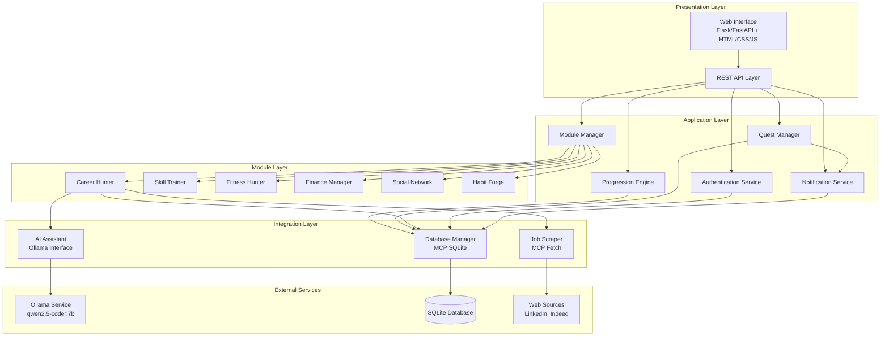
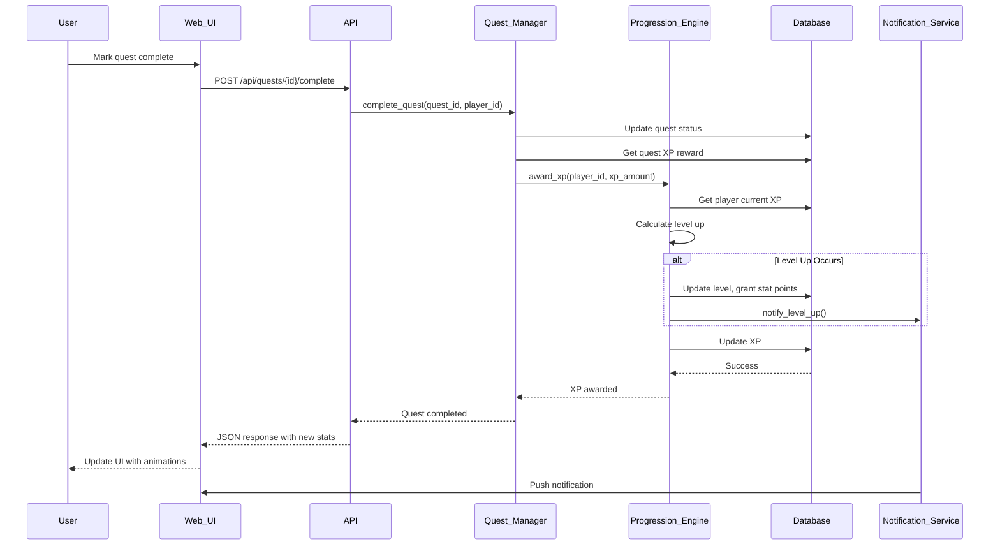
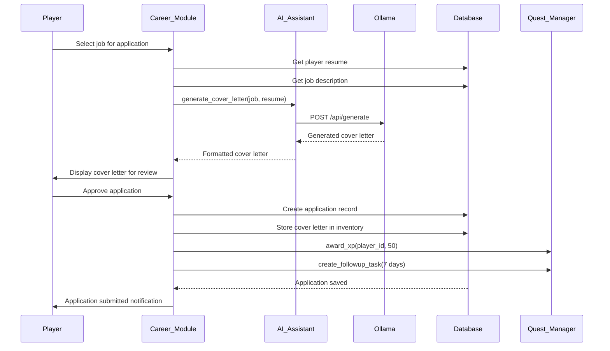
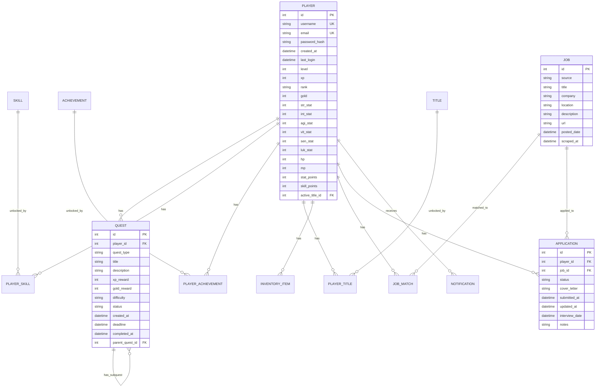

# Design Document

## Overview

LifeHunter is a comprehensive gamified life management system that transforms real-world tasks and personal development into an immersive RPG experience. The system architecture follows a modular design with six specialized life area modules (Career Hunter, Skill Trainer, Fitness Hunter, Finance Manager, Social Network, Habit Forge) built on top of a core progression engine.

The system leverages external services through MCP (Model Context Protocol) servers for database operations (SQLite), web scraping (Fetch), and AI assistance (Ollama with qwen2.5-coder:7b model). The web interface is built using Flask/FastAPI with a responsive HTML/CSS/JS frontend that provides real-time updates and visualizations.

Key design principles:
- **Modularity**: Life area modules operate independently but share core progression systems
- **Scalability**: Database schema and API design support future expansion
- **Real-time feedback**: UI updates without page reloads to maintain engagement
- **AI-driven adaptation**: Ollama integration provides personalized content and difficulty adjustment
- **Data integrity**: Transaction-based operations ensure consistent state across components

## Architecture

### High-Level Architecture



### Component Architecture

The system follows a layered architecture with clear separation of concerns:

1. **Presentation Layer**: Handles user interaction and rendering
   - Web Interface: Renders HTML/CSS/JS for browser clients
   - REST API: Provides JSON endpoints for all operations

2. **Application Layer**: Core business logic and orchestration
   - Progression Engine: Manages XP, levels, ranks, stats, skills
   - Quest Manager: Creates, tracks, and validates quests
   - Module Manager: Coordinates life area modules and unlock logic
   - Authentication Service: Handles user sessions and security
   - Notification Service: Manages event-driven notifications

3. **Module Layer**: Specialized domain components
   - Each module operates independently with its own data models
   - Modules communicate with core layer through well-defined interfaces
   - Modules unlock progressively based on player rank

4. **Integration Layer**: External service adapters
   - AI Assistant: Wrapper for Ollama API calls
   - Job Scraper: Web scraping via MCP Fetch
   - Database Manager: SQLite operations via MCP protocol

### Technology Stack

**Backend**:
- Python 3.10+
- Flask/FastAPI (web framework)
- SQLAlchemy (ORM for database operations)
- Requests (HTTP client for MCP communication)
- APScheduler (background job scheduling)
- bcrypt (password hashing)

**Frontend**:
- HTML5 with semantic markup
- CSS3 with Flexbox/Grid layout
- Vanilla JavaScript (ES6+)
- Chart.js (data visualization)
- Fetch API (async communication)

**External Services**:
- SQLite 3.35+ (database)
- MCP SQLite Server (database access protocol)
- MCP Fetch Server (web scraping protocol)
- Ollama with qwen2.5-coder:7b model (AI assistant)

**Development Tools**:
- Git (version control)
- PowerShell (automation scripts)
- pytest (testing framework)
- Hypothesis (property-based testing)

### Data Flow

#### Quest Completion Flow


#### Job Application Flow


## Components and Interfaces

### Core Components

#### 1. Progression Engine

**Responsibilities**:
- Calculate XP requirements and level progression
- Manage stat allocation and derived stats (HP, MP)
- Handle rank advancement and feature unlocking
- Track skill points and skill progression
- Award gold currency

**Public Interface**:
```python
class ProgressionEngine:
    def award_xp(self, player_id: int, xp_amount: int) -> Dict[str, Any]:
        """Award XP and handle level up if threshold reached."""
        
    def allocate_stat_point(self, player_id: int, stat_name: str) -> bool:
        """Allocate one stat point to specified attribute."""
        
    def allocate_skill_point(self, player_id: int, skill_id: int) -> bool:
        """Allocate one skill point to specified skill."""
        
    def get_player_stats(self, player_id: int) -> PlayerStats:
        """Retrieve current player statistics."""
        
    def check_rank_advancement(self, player_id: int) -> Optional[str]:
        """Check if player qualifies for rank promotion."""
        
    def calculate_xp_requirement(self, level: int) -> int:
        """Calculate XP needed for specified level."""
        
    def calculate_derived_stats(self, stats: Dict[str, int]) -> Dict[str, int]:
        """Calculate HP, MP from base stats."""
```

**Key Algorithms**:
- XP Formula: `xp_required = 100 * (level^1.5)`
- HP Formula: `HP = 100 + (VIT * 10)`
- MP Formula: `MP = 50 + (INT * 5)`
- Rank Thresholds: E(1), D(10), C(25), B(40), A(60), S(80), National(100)

#### 2. Quest Manager

**Responsibilities**:
- Create and track quests across all types
- Generate daily quests at midnight
- Manage instant dungeon timers
- Handle penalty zone activation
- Validate quest completion conditions

**Public Interface**:
```python
class QuestManager:
    def create_daily_quests(self, player_id: int, date: datetime) -> List[Quest]:
        """Generate 3-5 daily quests for specified date."""
        
    def create_main_quest(self, player_id: int, quest_data: Dict) -> Quest:
        """Create a new main quest with sub-quests."""
        
    def start_instant_dungeon(self, player_id: int, dungeon_data: Dict) -> InstantDungeon:
        """Start instant dungeon with timer."""
        
    def create_emergency_quest(self, player_id: int, quest_data: Dict) -> EmergencyQuest:
        """Create high-priority emergency quest."""
        
    def complete_quest(self, quest_id: int, player_id: int) -> QuestResult:
        """Mark quest complete and award rewards."""
        
    def check_daily_quest_failure(self, player_id: int, date: datetime) -> bool:
        """Check if daily quests incomplete at midnight."""
        
    def activate_penalty_zone(self, player_id: int) -> PenaltyZone:
        """Activate penalty zone for failed daily quests."""
        
    def get_active_quests(self, player_id: int) -> QuestCollection:
        """Retrieve all active quests organized by type."""
```

**Quest Types and Properties**:
- Daily Quest: 24-hour lifespan, 20-50 XP, mandatory completion
- Main Quest: Long-term, composed of sub-quests, 100-500 XP
- Instant Dungeon: 15 min - 4 hour duration, bonus XP on time completion
- Emergency Quest: High priority, 2x XP multiplier, -50 XP penalty on failure

#### 3. Module Manager

**Responsibilities**:
- Coordinate life area modules
- Enforce rank-based unlock requirements
- Route requests to appropriate modules
- Aggregate module statistics for dashboard

**Public Interface**:
```python
class ModuleManager:
    def get_available_modules(self, player_id: int) -> List[Module]:
        """Return modules unlocked for player's current rank."""
        
    def get_module(self, module_name: str) -> Module:
        """Retrieve specific module instance."""
        
    def check_module_unlock(self, player_id: int, module_name: str) -> bool:
        """Check if module is unlocked for player."""
        
    def get_module_statistics(self, player_id: int) -> Dict[str, ModuleStats]:
        """Aggregate statistics from all unlocked modules."""
```

**Module Unlock Requirements**:
- E-Rank: Career Hunter
- D-Rank: Skill Trainer
- C-Rank: Fitness Hunter
- B-Rank: Finance Manager
- A-Rank: Social Network
- S-Rank: Habit Forge

#### 4. Career Hunter Module

**Responsibilities**:
- Scrape job listings from external sources
- Match jobs to player skills using AI
- Generate cover letters with AI assistant
- Track application status
- Create interview preparation quests
- Generate follow-up tasks

**Public Interface**:
```python
class CareerHunterModule:
    def scrape_jobs(self, sources: List[str], keywords: List[str]) -> List[Job]:
        """Scrape jobs from specified sources with keyword filters."""
        
    def match_jobs(self, player_id: int, jobs: List[Job]) -> List[JobMatch]:
        """Calculate match scores for jobs against player skills."""
        
    def generate_cover_letter(self, player_id: int, job_id: int) -> str:
        """Generate AI-powered customized cover letter."""
        
    def create_application(self, player_id: int, job_id: int, cover_letter: str) -> Application:
        """Create application record and award XP."""
        
    def update_application_status(self, application_id: int, status: str) -> None:
        """Update application status and trigger related actions."""
        
    def generate_interview_prep(self, application_id: int) -> InterviewPrep:
        """Generate interview questions and company research."""
        
    def create_followup_task(self, application_id: int, days: int) -> Quest:
        """Create automated follow-up task."""
```

**Job Match Algorithm**:
1. Extract skills from job description using AI
2. Compare against player's skill inventory
3. Calculate skill overlap percentage
4. Weight by required vs. preferred skills
5. Return match score (0-100)

#### 5. AI Assistant

**Responsibilities**:
- Interface with Ollama service
- Generate cover letters
- Provide task prioritization suggestions
- Adjust quest difficulty based on performance
- Generate performance insights
- Create motivational messages

**Public Interface**:
```python
class AIAssistant:
    def generate_cover_letter(self, job_description: str, resume: str) -> str:
        """Generate customized cover letter."""
        
    def prioritize_quests(self, quests: List[Quest]) -> List[QuestPriority]:
        """Analyze and prioritize quest list."""
        
    def adjust_difficulty(self, player_id: int, performance_data: Dict) -> str:
        """Calculate and apply difficulty adjustment."""
        
    def generate_insights(self, player_id: int, period: str) -> List[str]:
        """Generate performance insights and recommendations."""
        
    def generate_motivational_message(self, context: str) -> str:
        """Generate contextual motivational message."""
        
    def extract_job_skills(self, job_description: str) -> List[str]:
        """Extract skill requirements from job description."""
```

**Ollama Integration**:
- Model: qwen2.5-coder:7b
- Temperature: 0.7 for creative content (cover letters, messages)
- Temperature: 0.3 for analytical tasks (prioritization, insights)
- Max tokens: 500 for cover letters, 200 for other tasks
- Timeout: 30 seconds with retry logic

#### 6. Job Scraper

**Responsibilities**:
- Fetch job listings via MCP Fetch server
- Parse HTML content to extract job data
- Handle rate limiting and retries
- Remove duplicate listings
- Store jobs in database

**Public Interface**:
```python
class JobScraper:
    def scrape_linkedin(self, keywords: List[str], location: str) -> List[Job]:
        """Scrape job listings from LinkedIn."""
        
    def scrape_indeed(self, keywords: List[str], location: str) -> List[Job]:
        """Scrape job listings from Indeed."""
        
    def parse_job_html(self, html: str, source: str) -> Job:
        """Parse HTML to extract job fields."""
        
    def deduplicate_jobs(self, jobs: List[Job]) -> List[Job]:
        """Remove duplicate jobs by title+company."""
        
    def schedule_scraping(self, interval_hours: int) -> None:
        """Schedule automatic scraping at interval."""
```

**Scraping Strategy**:
- Rate limit: 1 request per 2 seconds per domain
- Retry: 3 attempts with exponential backoff (2s, 4s, 8s)
- Timeout: 30 seconds per request
- User-Agent: Rotate browser user agents
- Respect robots.txt directives

#### 7. Database Manager

**Responsibilities**:
- Execute SQL queries via MCP SQLite server
- Manage connection pool
- Handle transaction rollback
- Perform daily backups
- Log all operations

**Public Interface**:
```python
class DatabaseManager:
    def execute_query(self, query: str, params: Tuple) -> List[Dict]:
        """Execute parameterized query and return results."""
        
    def execute_transaction(self, queries: List[Tuple[str, Tuple]]) -> bool:
        """Execute multiple queries in a transaction."""
        
    def backup_database(self, backup_path: str) -> bool:
        """Create database backup at specified path."""
        
    def validate_query(self, query: str) -> bool:
        """Validate query for safety before execution."""
        
    def get_connection(self) -> Connection:
        """Get connection from pool."""
```

**Connection Pool Configuration**:
- Maximum connections: 10
- Connection timeout: 30 seconds
- Idle timeout: 300 seconds
- Validation query: `SELECT 1`

### Interface Contracts

#### REST API Endpoints

**Player Endpoints**:
- `GET /api/player/{id}` - Retrieve player profile
- `GET /api/player/{id}/stats` - Get player statistics
- `POST /api/player/{id}/stats/allocate` - Allocate stat point
- `GET /api/player/{id}/skills` - Get skill tree
- `POST /api/player/{id}/skills/allocate` - Allocate skill point

**Quest Endpoints**:
- `GET /api/quests` - Get all active quests for player
- `POST /api/quests` - Create new quest
- `POST /api/quests/{id}/complete` - Mark quest complete
- `DELETE /api/quests/{id}` - Delete quest
- `GET /api/quests/daily` - Get today's daily quests

**Career Endpoints**:
- `GET /api/career/jobs` - Get matched jobs
- `POST /api/career/scrape` - Trigger job scraping
- `POST /api/career/applications` - Create application
- `GET /api/career/applications` - Get application history
- `PUT /api/career/applications/{id}` - Update application status
- `POST /api/career/cover-letter` - Generate cover letter

**Module Endpoints**:
- `GET /api/modules` - Get available modules
- `GET /api/modules/{name}/dashboard` - Get module dashboard data

**Authentication Endpoints**:
- `POST /api/auth/register` - Create new account
- `POST /api/auth/login` - Login and create session
- `POST /api/auth/logout` - End session
- `POST /api/auth/reset-password` - Reset password

## Data Models

### Core Entities

#### Player
```python
class Player:
    id: int                      # Primary key
    username: str                # Unique username
    email: str                   # Unique email
    password_hash: str           # bcrypt hashed password
    created_at: datetime         # Registration timestamp
    last_login: datetime         # Last login timestamp
    
    # Progression
    level: int                   # Current level (1-999)
    xp: int                      # Current experience points
    rank: str                    # Current rank (E/D/C/B/A/S/National)
    gold: int                    # Currency balance
    
    # Stats
    str_stat: int                # Strength attribute
    int_stat: int                # Intelligence attribute
    agi_stat: int                # Agility attribute
    vit_stat: int                # Vitality attribute
    sen_stat: int                # Sense attribute
    luk_stat: int                # Luck attribute
    hp: int                      # Health points (derived)
    mp: int                      # Mana points (derived)
    
    # Points
    stat_points: int             # Available stat points
    skill_points: int            # Available skill points
    
    # Title
    active_title_id: int         # Foreign key to Title
```

#### Quest
```python
class Quest:
    id: int                      # Primary key
    player_id: int               # Foreign key to Player
    quest_type: str              # daily/main/instant/emergency
    title: str                   # Quest title
    description: str             # Quest description
    xp_reward: int               # XP awarded on completion
    gold_reward: int             # Gold awarded on completion
    difficulty: str              # very_easy/easy/medium/hard/very_hard
    status: str                  # active/completed/failed
    created_at: datetime         # Creation timestamp
    deadline: datetime           # Completion deadline (optional)
    completed_at: datetime       # Completion timestamp (optional)
    parent_quest_id: int         # For sub-quests (optional)
```

#### Skill
```python
class Skill:
    id: int                      # Primary key
    name: str                    # Skill name
    description: str             # Skill description
    skill_type: str              # active/passive
    max_level: int               # Maximum skill level
    unlock_level: int            # Player level requirement
    prerequisite_skill_id: int   # Required skill (optional)
```

#### PlayerSkill
```python
class PlayerSkill:
    id: int                      # Primary key
    player_id: int               # Foreign key to Player
    skill_id: int                # Foreign key to Skill
    current_level: int           # Current skill level
    unlocked_at: datetime        # Unlock timestamp
```

#### Achievement
```python
class Achievement:
    id: int                      # Primary key
    name: str                    # Achievement name
    description: str             # Achievement description
    rarity: str                  # common/rare/epic/legendary
    condition_type: str          # level/quest_count/stat/custom
    condition_value: str         # JSON condition data
    stat_bonus: str              # JSON stat bonus data (optional)
    icon_url: str                # Achievement icon path
```

#### PlayerAchievement
```python
class PlayerAchievement:
    id: int                      # Primary key
    player_id: int               # Foreign key to Player
    achievement_id: int          # Foreign key to Achievement
    unlocked_at: datetime        # Unlock timestamp
```

#### Title
```python
class Title:
    id: int                      # Primary key
    name: str                    # Title name
    description: str             # Title description
    unlock_condition: str        # Unlock requirement description
    stat_bonuses: str            # JSON stat bonus data
```

#### PlayerTitle
```python
class PlayerTitle:
    id: int                      # Primary key
    player_id: int               # Foreign key to Player
    title_id: int                # Foreign key to Title
    unlocked_at: datetime        # Unlock timestamp
```

#### InventoryItem
```python
class InventoryItem:
    id: int                      # Primary key
    player_id: int               # Foreign key to Player
    item_type: str               # template/certificate/consumable
    name: str                    # Item name
    content: str                 # Item content (text/file path)
    acquired_at: datetime        # Acquisition timestamp
    used_at: datetime            # Usage timestamp (consumables)
```

### Career Module Entities

#### Job
```python
class Job:
    id: int                      # Primary key
    source: str                  # linkedin/indeed/other
    title: str                   # Job title
    company: str                 # Company name
    location: str                # Job location
    description: str             # Full job description
    url: str                     # Job posting URL
    posted_date: datetime        # Posting date (if available)
    scraped_at: datetime         # Scraping timestamp
```

#### JobMatch
```python
class JobMatch:
    id: int                      # Primary key
    player_id: int               # Foreign key to Player
    job_id: int                  # Foreign key to Job
    match_score: int             # 0-100 match score
    matching_skills: str         # JSON array of matching skills
    calculated_at: datetime      # Calculation timestamp
```

#### Application
```python
class Application:
    id: int                      # Primary key
    player_id: int               # Foreign key to Player
    job_id: int                  # Foreign key to Job
    status: str                  # submitted/under_review/interview/rejected/offered
    cover_letter: str            # Generated cover letter text
    submitted_at: datetime       # Submission timestamp
    updated_at: datetime         # Status update timestamp
    interview_date: datetime     # Interview date (optional)
    notes: str                   # Player notes (optional)
```

### System Entities

#### Notification
```python
class Notification:
    id: int                      # Primary key
    player_id: int               # Foreign key to Player
    notification_type: str       # quest_complete/level_up/achievement/etc
    title: str                   # Notification title
    message: str                 # Notification content
    is_read: bool                # Read status
    created_at: datetime         # Creation timestamp
```

#### PerformanceLog
```python
class PerformanceLog:
    id: int                      # Primary key
    metric_name: str             # Metric identifier
    metric_value: float          # Metric value
    timestamp: datetime          # Measurement timestamp
```

#### DatabaseBackup
```python
class DatabaseBackup:
    id: int                      # Primary key
    file_path: str               # Backup file location
    file_size: int               # Backup file size in bytes
    created_at: datetime         # Backup timestamp
```

### Database Schema Diagram



## Error Handling

### Error Categories

#### 1. Validation Errors
**Causes**: Invalid input data, constraint violations, business rule violations

**Handling Strategy**:
- Validate all input at API boundary
- Return 400 Bad Request with descriptive error message
- Log validation failures for monitoring
- Do not expose internal system details

**Examples**:
- Insufficient stat points for allocation
- Invalid quest type specified
- Negative XP value provided
- Player attempting to access locked module

#### 2. Authentication Errors
**Causes**: Invalid credentials, expired sessions, unauthorized access

**Handling Strategy**:
- Return 401 Unauthorized for invalid credentials
- Return 403 Forbidden for insufficient permissions
- Clear session data on authentication failure
- Implement account lockout after repeated failures
- Log all authentication events

**Examples**:
- Incorrect password
- Expired session token
- Accessing another player's data
- Account locked due to failed attempts

#### 3. External Service Errors
**Causes**: Ollama unavailable, MCP server timeout, web scraping failure

**Handling Strategy**:
- Implement retry logic with exponential backoff
- Return 503 Service Unavailable if retries exhausted
- Provide fallback behavior when possible
- Cache responses for critical services
- Alert administrators for persistent failures

**Examples**:
- Ollama service not responding
- MCP SQLite connection timeout
- Website blocking scraping requests
- Network connectivity issues

#### 4. Database Errors
**Causes**: Connection failures, query errors, constraint violations, deadlocks

**Handling Strategy**:
- Use transaction rollback for consistency
- Retry transient errors (deadlocks, timeouts)
- Return 500 Internal Server Error for unexpected failures
- Log full error context for debugging
- Notify administrators for data corruption

**Examples**:
- Foreign key constraint violation
- Unique constraint violation
- Connection pool exhausted
- Disk space full

#### 5. Business Logic Errors
**Causes**: Race conditions, state inconsistencies, impossible operations

**Handling Strategy**:
- Use database transactions to prevent race conditions
- Validate preconditions before operations
- Return 409 Conflict for state inconsistencies
- Log full operation context
- Provide recovery suggestions in error response

**Examples**:
- Completing already completed quest
- Allocating more points than available
- Starting instant dungeon while one is active
- Level down due to penalty exceeding current XP

### Error Response Format

All API errors return consistent JSON structure:
```json
{
    "error": {
        "code": "INSUFFICIENT_STAT_POINTS",
        "message": "Cannot allocate stat point: 0 points available",
        "details": {
            "requested": "STR",
            "available_points": 0,
            "player_id": 123
        },
        "timestamp": "2024-01-15T14:30:00Z"
    }
}
```

### Recovery Mechanisms

#### Automatic Recovery
- Retry failed external service calls (3 attempts)
- Reconnect to database on connection loss
- Regenerate expired session tokens
- Resume interrupted background jobs

#### Manual Recovery
- Database backup restoration
- Data export/import for player migration
- Administrator tools for data correction
- Support ticket system for user assistance

### Monitoring and Alerting

**Metrics to Monitor**:
- Error rate by category and endpoint
- Response time percentiles (p50, p95, p99)
- External service availability
- Database connection pool usage
- Failed login attempts
- Quest completion rate anomalies

**Alert Conditions**:
- Error rate exceeds 5% over 5 minutes
- Response time p95 exceeds 2 seconds
- External service unavailable for 2 minutes
- Database connection pool >80% full
- More than 10 failed logins for single account in 5 minutes


## Correctness Properties

*A property is a characteristic or behavior that should hold true across all valid executions of a system—essentially, a formal statement about what the system should do. Properties serve as the bridge between human-readable specifications and machine-verifiable correctness guarantees.*

### Property Reflection

After analyzing all acceptance criteria, I identified the following areas with testable universal properties:

**Core Progression Logic** (Requirements 1, 2, 3):
- XP calculation and level advancement
- Stat point allocation and derived stat calculations
- Rank advancement thresholds

**Quest Management** (Requirements 4, 5, 8):
- Quest completion and XP rewards
- Sub-quest progress tracking
- Penalty zone state transitions

**Inventory and Currency** (Requirements 12, 13):
- Inventory operations (add, remove, search)
- Gold balance invariants (always >= 0)

**Module System** (Requirement 14):
- Module unlocking based on rank

**Configuration Management** (Requirement 42):
- Configuration parsing and printing round-trip

**Data Export** (Requirement 40):
- Player data serialization round-trip

**Redundancy Analysis**:
- Properties 1 and 2 both test XP and level progression - **consolidated** into a single comprehensive property
- Properties related to specific stat formulas (HP, MP) can be **combined** into derived stat calculation property
- Quest completion XP rewards across different quest types share common logic - **consolidated** into universal quest completion property
- Multiple properties about point allocation (stat points, skill points) follow same pattern - **consolidated** into point allocation property

### Property 1: Level Progression Through XP Accumulation

*For any* player at any level (1-999) and any amount of XP awarded, when XP is added to the player's total, if the new total meets or exceeds the level threshold (100 * level^1.5), the player's level SHALL increment by 1 and the threshold SHALL be recalculated for the new level.

**Validates: Requirements 1.1, 1.2, 1.4**

### Property 2: Level Boundary Invariant

*For any* operation that modifies player level, the resulting level SHALL remain within the bounds [1, 999].

**Validates: Requirements 1.5**

### Property 3: Point Allocation Correctness

*For any* player with available stat points or skill points, allocating a point to a valid attribute or skill SHALL decrement the available points by 1, increment the target attribute/skill by 1, and maintain the invariant that available_points >= 0.

**Validates: Requirements 1.3, 1.7, 3.3, 9.3, 9.4**

### Property 4: Derived Stat Calculation

*For any* player with base stat values, the derived stats SHALL be calculated as: HP = 100 + (VIT * 10) and MP = 50 + (INT * 5), and any change to VIT or INT SHALL trigger immediate recalculation of HP or MP respectively.

**Validates: Requirements 3.5, 3.6, 3.7**

### Property 5: Daily Quest Count Constraint

*For any* daily quest generation operation, the number of quests created SHALL be between 3 and 5 (inclusive).

**Validates: Requirements 4.2**

### Property 6: Quest Completion Rewards

*For any* quest of any type with a defined XP reward, when the quest is marked as completed, the player SHALL receive exactly the specified XP reward and the quest status SHALL change from "active" to "completed".

**Validates: Requirements 1.1, 4.3, 5.4**

### Property 7: Daily Quest Completion Percentage

*For any* set of daily quests with some subset completed, the completion percentage SHALL equal (completed_count / total_count) * 100, and the percentage SHALL be in the range [0, 100].

**Validates: Requirements 4.6**

### Property 8: Main Quest Sub-quest Completion Propagation

*For any* main quest with N sub-quests, when all N sub-quests have status "completed", the main quest status SHALL automatically change to "completed".

**Validates: Requirements 5.3**

### Property 9: Main Quest Progress Percentage

*For any* main quest with N sub-quests and K completed sub-quests (where K <= N), the progress percentage SHALL equal (K / N) * 100.

**Validates: Requirements 5.5**

### Property 10: Concurrent Main Quest Limit

*For any* player with N active main quests (where N < 10), creating a new main quest SHALL succeed; for any player with 10 active main quests, attempting to create another SHALL fail with an appropriate error.

**Validates: Requirements 5.6**

### Property 11: Penalty Zone State Machine

*For any* player who fails to complete all daily quests before midnight, the penalty zone SHALL activate (status = "active"); when the penalty challenge is completed, the penalty zone SHALL deactivate (status = "inactive"); if penalty challenge fails, the penalty zone SHALL deactivate AND player XP SHALL decrease by 100.

**Validates: Requirements 8.1, 8.2, 8.3, 8.4**

### Property 12: Skill Unlock Based on Level Threshold

*For any* player at level L and any skill with unlock_level U, the skill SHALL be unlocked if and only if L >= U.

**Validates: Requirements 9.1**

### Property 13: Passive Skill Bonus Application

*For any* player with an equipped passive skill that grants stat bonuses, the player's effective stats SHALL include the passive skill bonuses automatically without requiring activation.

**Validates: Requirements 9.6**

### Property 14: Achievement Unlock Based on Conditions

*For any* player whose current state satisfies an achievement's unlock conditions, the achievement SHALL transition from "locked" to "unlocked" status.

**Validates: Requirements 10.1**

### Property 15: Title Bonus Application Toggle

*For any* player who equips a title with stat bonuses B, the player's stats SHALL increase by B; when the title is unequipped, the player's stats SHALL decrease by B, maintaining the invariant that equip then unequip returns to original stats.

**Validates: Requirements 11.3, 11.4**

### Property 16: Inventory Item Addition and Removal

*For any* player's inventory with I items and capacity limit C, adding a new item when I < C SHALL succeed and increase the count to I+1; adding an item when I >= C SHALL fail; removing an existing item SHALL decrease the count to I-1; removing a non-existent item SHALL fail.

**Validates: Requirements 12.2, 12.4, 12.5**

### Property 17: Gold Balance Non-Negativity Invariant

*For any* gold transaction (award or spend), the resulting player gold balance SHALL be >= 0; any operation that would result in negative balance SHALL be rejected.

**Validates: Requirements 13.2, 13.3, 13.4**

### Property 18: Module Unlock Based on Rank

*For any* player at rank R, the set of available modules SHALL equal the union of all modules with unlock_rank <= R, following the progression: E-Rank (Career), D-Rank (+Skill), C-Rank (+Fitness), B-Rank (+Finance), A-Rank (+Social), S-Rank (+Habit).

**Validates: Requirements 14.1, 14.2, 14.3, 14.4, 14.5, 14.6, 14.7**

### Property 19: Job Deduplication

*For any* list of scraped jobs, applying deduplication based on (title, company) pairs SHALL result in a list where no two jobs have identical (title, company) combinations.

**Validates: Requirements 15.5**

### Property 20: Application State Transition Validity

*For any* job application, status transitions SHALL follow valid state machine paths: submitted → under_review → {interview_scheduled, rejected}, interview_scheduled → {offered, rejected}. Invalid transitions SHALL be rejected.

**Validates: Requirements 18.1, 18.2**

### Property 21: Follow-up Task Cancellation on Terminal Status

*For any* application that reaches a terminal status (rejected or offered), all associated pending follow-up tasks SHALL be cancelled.

**Validates: Requirements 20.7**

### Property 22: Configuration Parse-Print Round-Trip

*For any* valid configuration object C, the sequence parse(print(C)) SHALL produce a configuration object equivalent to C (round-trip identity).

**Validates: Requirements 42.4**

### Property 23: Player Data Export-Import Round-Trip

*For any* player data object P, the sequence import(export(P)) SHALL produce a player data object equivalent to P (round-trip identity).

**Validates: Requirements 40.1, 40.2, 40.4, 40.5**

### Property 24: Notification Rate Limiting

*For any* event type and 1-minute time window, no more than 1 notification of that event type SHALL be generated, regardless of how many events occur.

**Validates: Requirements 41.7**

## Testing Strategy

### Testing Approach

LifeHunter requires a comprehensive testing strategy that combines multiple testing methodologies:

1. **Property-Based Testing**: For core business logic with universal properties
2. **Example-Based Unit Testing**: For specific scenarios and edge cases
3. **Integration Testing**: For external service interactions (database, AI, web scraping)
4. **UI Testing**: For web interface components
5. **Performance Testing**: For response time and throughput requirements
6. **Security Testing**: For authentication and authorization

### Property-Based Testing Strategy

**Library Selection**: Hypothesis (Python)

**Test Configuration**:
- Minimum iterations per property test: 100
- Random seed management for reproducibility
- Shrinking enabled for minimal failing examples

**Property Test Tagging**:
Each property-based test MUST include a comment tag:
```python
# Feature: lifehunter-system, Property 1: Level Progression Through XP Accumulation
@given(st.integers(min_value=1, max_value=999), st.integers(min_value=1, max_value=10000))
def test_level_progression(level, xp_to_add):
    # Test implementation
```

**Generator Strategies**:

*Player Generators*:
```python
@st.composite
def player_strategy(draw):
    return Player(
        level=draw(st.integers(min_value=1, max_value=999)),
        xp=draw(st.integers(min_value=0, max_value=1000000)),
        str_stat=draw(st.integers(min_value=10, max_value=999)),
        int_stat=draw(st.integers(min_value=10, max_value=999)),
        agi_stat=draw(st.integers(min_value=10, max_value=999)),
        vit_stat=draw(st.integers(min_value=10, max_value=999)),
        sen_stat=draw(st.integers(min_value=10, max_value=999)),
        luk_stat=draw(st.integers(min_value=10, max_value=999)),
        stat_points=draw(st.integers(min_value=0, max_value=100)),
        skill_points=draw(st.integers(min_value=0, max_value=100))
    )
```

*Quest Generators*:
```python
@st.composite
def quest_strategy(draw):
    return Quest(
        quest_type=draw(st.sampled_from(['daily', 'main', 'instant', 'emergency'])),
        title=draw(st.text(min_size=5, max_size=100)),
        description=draw(st.text(min_size=10, max_size=500)),
        xp_reward=draw(st.integers(min_value=10, max_value=1000)),
        difficulty=draw(st.sampled_from(['very_easy', 'easy', 'medium', 'hard', 'very_hard'])),
        status=draw(st.sampled_from(['active', 'completed', 'failed']))
    )
```

*Configuration Generators*:
```python
@st.composite
def config_strategy(draw):
    return Configuration(
        database_path=draw(st.text(min_size=1, max_size=255)),
        ollama_host=draw(st.text(min_size=7, max_size=255)),  # min_size=7 for "http://"
        session_timeout=draw(st.integers(min_value=60, max_value=86400)),
        max_daily_quests=draw(st.integers(min_value=3, max_value=5))
    )
```

**Properties to Implement**:
- All 24 properties listed in the Correctness Properties section
- Each property maps to one or more test functions
- Properties involving external services use mocks

### Unit Testing Strategy

**Framework**: pytest

**Test Organization**:
```
tests/
├── unit/
│   ├── test_progression_engine.py
│   ├── test_quest_manager.py
│   ├── test_career_hunter.py
│   ├── test_ai_assistant.py
│   └── test_database_manager.py
├── integration/
│   ├── test_database_integration.py
│   ├── test_ollama_integration.py
│   ├── test_web_scraping.py
│   └── test_api_endpoints.py
├── property/
│   ├── test_progression_properties.py
│   ├── test_quest_properties.py
│   ├── test_config_properties.py
│   └── test_data_export_properties.py
└── ui/
    ├── test_dashboard.py
    ├── test_quest_log.py
    └── test_skill_tree.py
```

**Example-Based Tests**:
- Rank advancement at specific thresholds (levels 10, 25, 40, 60, 80, 100)
- Specific XP bonuses (daily quest completion: 50 XP, emergency quest: 2x, etc.)
- Initial player setup (all stats start at 10)
- Specific quest count limits (max 10 main quests, max 3 emergency quests)
- Error cases (insufficient points, invalid transitions, etc.)

**Test Coverage Goals**:
- Line coverage: 85%
- Branch coverage: 80%
- Property test coverage: 100% of identified properties

### Integration Testing Strategy

**External Service Mocking**:
- Mock MCP SQLite server for database tests
- Mock Ollama API for AI assistant tests
- Mock MCP Fetch server for web scraping tests
- Use in-memory SQLite for fast integration tests
- Use VCR.py for recording HTTP interactions

**Integration Test Scenarios**:
1. **Database Integration**:
   - Player CRUD operations through MCP SQLite
   - Transaction rollback on error
   - Connection pool behavior under load
   - Backup and restore operations

2. **AI Integration**:
   - Cover letter generation with Ollama
   - Task prioritization with timeout handling
   - Difficulty adjustment with fallback
   - API error handling and retries

3. **Web Scraping Integration**:
   - Job scraping from mock HTML pages
   - Rate limiting enforcement
   - Retry logic on failures
   - Robots.txt compliance

4. **End-to-End Workflows**:
   - Complete quest → award XP → level up → unlock skill
   - Apply to job → interview scheduled → prep quest created → follow-up task generated
   - Daily quest failure → penalty zone → penalty completion → resume normal

### UI Testing Strategy

**Framework**: Selenium WebDriver with pytest

**UI Test Scenarios**:
- Dashboard displays correct player stats
- Quest log shows quests organized by type
- Stat allocation updates UI immediately
- XP bar animates on quest completion
- Skill tree renders with correct lock states
- Achievement gallery shows completion status
- Mobile responsive breakpoints work correctly
- Accessibility (keyboard navigation, screen reader labels)

**Visual Regression Testing**:
- Screenshot comparison for key UI states
- Use Percy or BackstopJS for visual diffs

### Performance Testing Strategy

**Framework**: Locust for load testing

**Performance Requirements**:
- API response time p95 < 2 seconds
- Dashboard page load < 2 seconds
- Quest completion < 1 second
- Stat allocation < 1 second
- AI cover letter generation < 30 seconds
- Database persistence < 5 seconds

**Load Test Scenarios**:
- 100 concurrent users browsing dashboard
- 50 concurrent quest completions per second
- 10 concurrent job scraping operations
- Database backup under active use

**Performance Benchmarks**:
- XP calculation: < 1ms per operation
- Level-up check: < 5ms per operation
- Quest deduplication: < 100ms for 1000 jobs
- Configuration parsing: < 1 second for 10KB file

### Security Testing Strategy

**Security Test Areas**:
1. **Authentication**:
   - Password hashing with bcrypt
   - Session management and expiry
   - Account lockout after failed attempts
   - SQL injection prevention (parameterized queries)

2. **Authorization**:
   - Players can only access their own data
   - Module access restricted by rank
   - Admin functions require elevated privileges

3. **Input Validation**:
   - Quest titles/descriptions sanitized
   - File uploads validated (exports/imports)
   - SQL queries validated before execution
   - API inputs validated against schemas

4. **Dependency Scanning**:
   - Regular updates for known vulnerabilities
   - Use Snyk or Safety to scan dependencies

### Continuous Integration Strategy

**CI Pipeline** (GitHub Actions or GitLab CI):
1. Lint code (flake8, pylint)
2. Type check (mypy)
3. Run unit tests with coverage
4. Run property-based tests
5. Run integration tests
6. Run UI tests (on PR only)
7. Security scan dependencies
8. Build Docker image
9. Deploy to staging (on main branch)

**Test Execution Time Budget**:
- Unit tests: < 2 minutes
- Property tests: < 5 minutes
- Integration tests: < 10 minutes
- UI tests: < 15 minutes
- Total CI pipeline: < 30 minutes

### Test Data Management

**Test Database**:
- Use SQLite in-memory database for unit tests
- Use fixture files for consistent test data
- Use factories (Factory Boy) for generating test objects
- Reset database between test runs

**Test Fixtures**:
```python
@pytest.fixture
def sample_player():
    return Player(
        id=1,
        username="test_player",
        level=5,
        xp=500,
        rank="E",
        stat_points=10
    )

@pytest.fixture
def sample_quest():
    return Quest(
        id=1,
        player_id=1,
        quest_type="daily",
        title="Complete coding challenge",
        xp_reward=50,
        difficulty="medium",
        status="active"
    )
```

### Regression Testing Strategy

**Regression Test Suite**:
- All property tests run on every commit
- Critical path integration tests run on every commit
- Full test suite runs nightly
- Performance benchmarks run weekly

**Breaking Change Detection**:
- API contract tests with schema validation
- Database migration tests
- Backward compatibility tests for imports/exports

### Manual Testing Checklist

**Pre-Release Manual Tests**:
- [ ] New player onboarding flow
- [ ] Quest creation and completion across all types
- [ ] Stat and skill point allocation
- [ ] Rank advancement and module unlocking
- [ ] Job scraping and application workflow
- [ ] Cover letter generation quality
- [ ] Mobile responsiveness on multiple devices
- [ ] Cross-browser compatibility (Chrome, Firefox, Safari, Edge)
- [ ] Accessibility with screen reader
- [ ] Data export and import
- [ ] Backup and restore

**User Acceptance Testing**:
- Recruit beta testers for real-world usage
- Collect feedback on gamification effectiveness
- Monitor engagement metrics (daily active users, quest completion rates)
- Iterate on difficulty balancing based on user performance data
